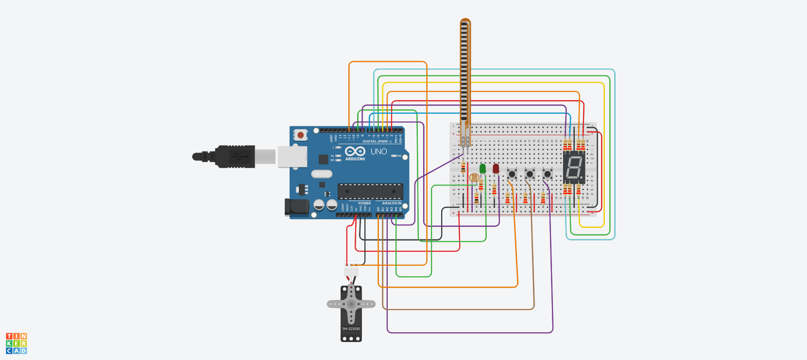

# Ejercicio parcial SPD Parte Practica Domiciliaria 
## Autor: Urriche Martin

Consigna: 
Se nos pide armar un modelo de montacarga funcional como maqueta para un hospital. El
objetivo es que implementes un sistema que pueda recibir ordenes de subir, bajar o pausar
desde diferentes pisos y muestre el estado actual del montacargas en el display 7
segmentos.

Requisitos del Proyecto:

1)Interfaz de usuario:

    • Deberá haber 3 botones, uno para subir pisos, otro para bajar pisos y otro para
    detener el montacarga.

    • Deberá tener 2 LEDs, uno verde que indicará cuando el montacarga este en
    movimiento, otro rojo que indique cuando el montacarga esté pausado.

    • En el display 7 segmentos deberán informar en tiempo real en qué piso se
    encuentra el elevador.

    • Se sabe que el tiempo de trayecto entre pisos es de 3 segundos (3000 ms). •

    Se deberá informar por monitor serial el piso en el que se encuentra el
    montacarga, este en funcionamiento o en pausa.

2)Funcionamiento del montacarga:

    • Implementa un algoritmo que permita que el elevador suba y baje o frene
    presionando los botones correspondientes.

    • Deberán buscar una forma para pausar el montacargas cuando el usuario lo
    determine.

3)Documentación:

    • Deberán presentar un diagrama esquemático del circuito y explicar el
    funcionamiento aplicado de cada componente.

    • Presentar el código fuente del proyecto de Arduino listo para ser
    implementado.

    • Deberán explicar el funcionamiento integral utilizando documentación
    MarkDown.

## Arduino:

## Codigo:

~~~ C++ 
//C++ code
//Foto resistencia
int fotoresistencia = A4;
int valorFotoresistencia = 0;
//Sensor Flexion
const int sensorFlexion = A3;
//Servo
#include <Servo.h>
Servo servoMotor;
//Botones
const int botonSubir = A0;
const int botonParar = A1;
const int botonBajar = A2;
//Leds
const int ledEnMovimiento = 9;
const int ledParado = 10;
//Variables Montacargas
int pisoActual = 0;
int pisoMaximo = 9;
bool enMovimiento = false;
bool enMovimientoBajada = false;
bool enMovimientoSubida = false;
bool pausado = false;
// Tiempo entre pisos
const unsigned long tiempo = 3000; 
unsigned long tiempoActual = 0;
unsigned long tiempoPasado = 0;
// Display
const int pinesDisplay[7] = {2,3,4,5,6,7,8};
void setup()
{
  //Leds como output
  pinMode(ledEnMovimiento, OUTPUT);
  pinMode(ledParado, OUTPUT);
  //Sensor como 
  pinMode(sensorFlexion, INPUT);
  //Servo como output
  servoMotor.attach(11);
  //Botones como input
  pinMode(botonSubir, INPUT_PULLUP);
  pinMode(botonParar, INPUT_PULLUP);
  pinMode(botonBajar, INPUT_PULLUP);
  for(int i = 0; i < 7; i++)
  {
    pinMode(pinesDisplay[i], OUTPUT);
  }
  Serial.begin(9600);
}

void loop()
{
  cambioEstadoBotones();
  mostrarMovimientoMontacarga();
  motrarPisoActual(pisoActual);
  escribirPisoActual();
  modificarMontacargas();
  verificarMontacargarEnMovimiento();
}

void cambioEstadoBotones()
{
  bool Subir = digitalRead(botonSubir);
  bool Bajar = digitalRead(botonBajar);
  bool Parar = digitalRead(botonParar);
  
  if (Subir == HIGH)
  {
    enMovimiento = true;
    enMovimientoSubida = true;
    enMovimientoBajada = false;
  }
  
  if (Bajar == HIGH)
  {
    enMovimiento = true;
    enMovimientoBajada = true;
    enMovimientoSubida = false;
  }
  
  if(Parar == HIGH)
  {
    enMovimiento = false;
  }
 
}

void mostrarMovimientoMontacarga()
{
  valorFotoresistencia= analogRead(fotoresistencia);
  if(enMovimiento == true)
  {
    if(valorFotoresistencia>256)
    {
      digitalWrite(ledEnMovimiento, HIGH);
      digitalWrite(ledParado, LOW);
    }
    else
    {
      digitalWrite(ledEnMovimiento, LOW);
      digitalWrite(ledParado, LOW);
    }
  }
  else
  {
    if(valorFotoresistencia>256)
    {
      digitalWrite(ledEnMovimiento, LOW);
      digitalWrite(ledParado, HIGH);
    }
    else
    {
      digitalWrite(ledEnMovimiento, LOW);
      digitalWrite(ledParado, LOW);
    }
  }
}

void motrarPisoActual(int piso)
{
  const byte patronesDigito[10] =
  {
   //GFEDCBA
    B0111111, // 0       
    B0000101, // 1       
    B1011011, // 2       
    B1001111, // 3       
    B1100101, // 4       
    B1101110, // 5 
    B1111110, // 6
    B0000111, // 7
    B1111111, // 8
    B1100111  // 9
  };
  
  if(piso >= 0 && piso <= 9)
  {
    byte patron = patronesDigito[piso];
    
    for(int i = 0; i < 7; i++)
    {
      digitalWrite(pinesDisplay[i], bitRead(patron, i));
    }
  }
}

void escribirPisoActual()
{
  Serial.print("Piso:  ");
  Serial.print(pisoActual);
  Serial.print(" Estado: ");
  
  if (enMovimiento)
  {
    Serial.println("En movimiento");
  } 
  else 
  {
    Serial.println("Detenido");
  } 
  delay(3000);
}

void modificarMontacargas()
{
  if(enMovimiento == true)
  {
    tiempoActual = millis() - tiempoPasado;
    if(tiempoActual >= tiempo)
    {
      tiempoPasado = millis();
      if(enMovimientoSubida == true)
      {
        if(pisoActual < pisoMaximo)
        {
          pisoActual++;
        }
      }
      else if(enMovimientoBajada >= 0)
        {
          if(pisoActual >= 0)
          {
            pisoActual--;
          }
        }
    }
  }
}
void verificarMontacargarEnMovimiento()
{
  servoMotor.write(0);
  if(enMovimiento == true)
  {
    if(pisoActual>=0 && pisoActual<=9)
    {
      servoMotor.write(180);
    }
  }
}

~~~
